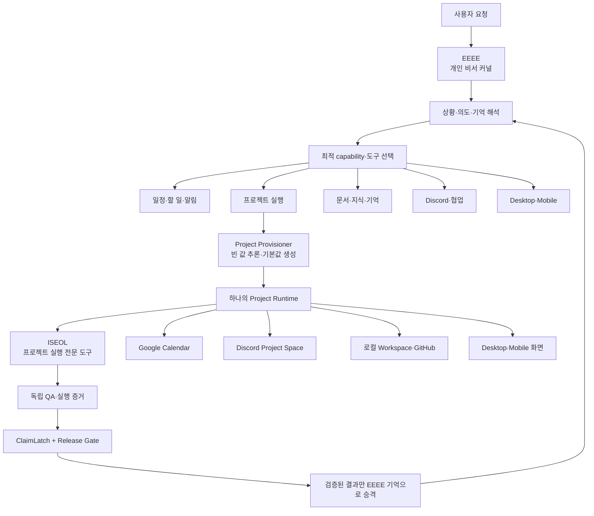

# EEEE Personal Assistant Platform Design

## 1. 결정 사항

`eeee-platform`은 EEEE, ISEOL, ClaimLatch를 따로 설치하는 세 제품이 아니라 하나의 로컬 오픈소스 프로젝트다.

- `EEEE`: 사용자의 상황을 이해하고 가장 적합한 능력과 외부 도구를 선택하는 최상위 개인 비서 커널
- `ISEOL`: 프로젝트 실행이 필요할 때 EEEE가 선택하는 전문 실행 확장. 프로젝트 내부의 Agent 팀, 작업 분해, 병렬 실행, 독립 QA를 관리한다.
- `ClaimLatch`: 모든 AI 결과와 위험한 도구 실행에 적용되는 전역 신뢰성 게이트
- `Deterministic QA`: 파일, 명령, 테스트, revision을 실제로 확인하는 기계적 검증 계층
- `Project Runtime`: 프로젝트 하나를 로컬 workspace, ISEOL 실행, Discord, Google Calendar, Desktop/Mobile, 기억과 함께 묶는 공통 실행 단위

사용자에게 보이는 제품은 EEEE 하나다. 내부 모듈은 책임별로 분리하되, 사용자는 상황에 따라 EEEE가 자동으로 조합한 결과만 받는다.

## 2. 문제 정의와 목표

현재 통합 저장소는 프로젝트 개발 흐름과 EEEE 개인 비서 흐름이 같은 애플리케이션 안에 있지만, 진입점과 책임 경계가 프로젝트 실행 중심으로 보인다. 그 결과 다음 문제가 생긴다.

1. 일정, 문서, 통신, 프로젝트 요청을 같은 비서가 처리한다는 모델이 코드에 드러나지 않는다.
2. ISEOL이 EEEE의 하위 프로젝트 실행 확장이라는 관계가 API와 문서에 분산되어 있다.
3. Discord 방 생성, Calendar 등록, Desktop/Mobile 표시가 프로젝트의 부가 기능이 아니라 Project Runtime의 연결 어댑터라는 점이 명확하지 않다.
4. ClaimLatch가 결과 검증과 기억 승격에 사용되지만, 외부 side effect에도 적용되는 전역 정책으로 정리되어 있지 않다.

이번 설계의 목표는 다음과 같다.

- 자연어 요청 하나를 EEEE가 상황에 맞는 capability로 라우팅한다.
- 프로젝트를 만들 때 Project ID 하나 아래 workspace, 일정, Discord 공간, ISEOL 팀, 화면, 기억 정책을 함께 구성한다.
- 외부 서비스가 설정되지 않은 로컬에서도 전체 흐름이 `planned` 또는 `awaiting_configuration` 상태로 안전하게 설명 가능해야 한다.
- ClaimLatch PASS와 독립 QA 증거가 없으면 외부 side effect, release, 영속 기억 승격을 성공으로 보고하지 않는다.
- 새 capability와 새 connector를 기존 EEEE 커널을 수정하지 않고 등록할 수 있게 한다.

## 3. 사용자 관점의 전체 흐름



## 4. 시스템 조직도

```text
사용자
  │
  ▼
┌─────────────────────────────────────────────────────────┐
│ EEEE Assistant Kernel                                   │
│                                                         │
│ Context / Intent · Memory · Capability Registry         │
│ Tool Selection · Planning · Policy / Approval            │
│ Action / Event Engine · Notifications · Audit            │
└───────────────┬─────────────────────────────────────────┘
                │ 선택한 capability 실행
                ▼
┌─────────────────────────────────────────────────────────┐
│ Capability Layer                                         │
│                                                         │
│ Personal Secretary · Project · Knowledge / Documents     │
│ Communication · Presence / Device · Automation           │
└───────────────┬─────────────────────────────────────────┘
                │ 프로젝트 capability 선택 시
                ▼
┌─────────────────────────────────────────────────────────┐
│ Unified Project Runtime                                  │
│                                                         │
│ Project Profile · Workspace · Calendar · Discord         │
│ ISEOL execution · Desktop/Mobile view · Project Memory   │
└───────────────┬─────────────────────────────────────────┘
                │ 전문 프로젝트 실행
                ▼
┌─────────────────────────────────────────────────────────┐
│ ISEOL Project Execution Organization                     │
│                                                         │
│ Coordinator → Task Decomposer → Agent Team Factory      │
│ → Specialist Agents → Review / QA → Integration / Release│
└───────────────┬─────────────────────────────────────────┘
                │ 모든 AI 결과·side effect·기억 승격
                ▼
┌─────────────────────────────────────────────────────────┐
│ Global Trust & Quality Layer                             │
│                                                         │
│ ClaimLatch v0.2.0 integration profile                    │
│ Deterministic Verification · Independent QA              │
│ Evidence Ledger · Release Gate · Memory Promotion Gate   │
└─────────────────────────────────────────────────────────┘
```

## 5. 책임 경계

| 구성요소 | 담당 | 담당하지 않는 것 |
|---|---|---|
| EEEE Kernel | 사용자 의도, 상황, 기억, capability 선택, 승인, 자동화, 보고 | 개별 프로젝트 Agent의 세부 작업을 직접 수행하지 않음 |
| Capability Registry | capability와 connector의 선언, 검색, 우선순위 | capability 내부의 도메인 업무 구현 |
| Project Runtime | 프로젝트 하나의 공통 ID, profile, 상태, 연결 리소스, 이벤트 | 모든 프로젝트에 동일한 Agent 조직을 강제하지 않음 |
| ISEOL | 프로젝트 계획, Agent 분해·배정·실행·handoff·독립 QA·통합 | 사용자의 전역 개인 기억을 직접 승격하지 않음 |
| Connector | Calendar, Discord, GitHub, Desktop, Mobile 등 외부 경계 연결 | 검증을 우회한 성공 보고 |
| ClaimLatch | AI 주장·결과·행동 요청의 신뢰성/정책 판정, report·receipt 생성 | 코드가 실제로 동작하는지 단독 판정하지 않음 |
| Deterministic QA | 명령 exit status, 파일, artifact, revision, 테스트 실행 확인 | 자연어 주장만으로 성공 판정하지 않음 |
| EEEE Memory | 검증된 개인/프로젝트/QA 경험의 장기 저장·검색·승격·폐기 | 미검증 결과를 사실처럼 저장하지 않음 |

## 6. 하나의 프로젝트를 만드는 규칙

프로젝트 생성은 단순히 폴더 하나를 만드는 API가 아니다. EEEE는 `Project Provisioner`를 통해 하나의 Project Runtime을 생성한다.

### 6.1 Provisioning 입력

- 사용자의 원문 요청
- 사용자의 일정, 시간대, 우선순위, 선호
- 관련된 EEEE Memory와 이전 QA rule
- 사용 가능한 capability와 connector 목록
- 로컬 정책과 ClaimLatch 정책

### 6.2 Provisioning 결과

```text
Project Runtime
├─ projectId / projectRevision
├─ Project Profile
│  ├─ goal / scope / constraints
│  ├─ schedule / milestones
│  ├─ selected capabilities
│  ├─ user preferences
│  └─ acceptance criteria / QA baseline
├─ local workspace
├─ ISEOL team composition
├─ Discord project space plan 또는 실제 생성 결과
├─ Google Calendar event plan 또는 실제 등록 결과
├─ Desktop/Mobile project surface
├─ Git/GitHub mapping
├─ notification policy
└─ project memory scope
```

### 6.3 빈 값 자동 채움

EEEE는 모든 빈 값을 임의로 확정하지 않는다. 다음 규칙을 적용한다.

1. 과거 기억과 사용자의 기본 선호를 먼저 검색한다.
2. 위험이 낮고 되돌릴 수 있는 값은 기본값으로 채운다.
3. 일정, 외부 전송, 공개, 삭제, 배포처럼 side effect가 있는 값은 `planned`로 만들고 정책에 따라 승인받는다.
4. 목표 달성에 영향을 주는 불확실성만 질문한다.
5. 추론된 값, 사용자가 지정한 값, connector가 실제 확인한 값을 각각 provenance로 기록한다.

## 7. EEEE 확장 모델

새 기능은 EEEE Kernel에 직접 조건문을 추가하지 않고 capability로 등록한다.

```python
class Capability(Protocol):
    descriptor: CapabilityDescriptor

    def can_handle(self, request: AssistantRequest) -> CapabilityMatch: ...

    def plan(self, request: AssistantRequest, context: AssistantContext) -> CapabilityPlan: ...

    def execute(self, plan: CapabilityPlan) -> CapabilityResult: ...
```

필수 descriptor 필드:

- `id`, `version`, `display_name`
- `intents`와 `trigger_phrases`
- 필요한 connectors
- side effect 등급
- 필요한 승인 등급
- 적용할 ClaimLatch policy
- 결과를 EEEE Memory에 저장할 수 있는지

초기 capability 목록:

- `personal-secretary`: 일정, 할 일, 리마인더, 루틴
- `project-execution`: Project Runtime을 만들고 ISEOL로 위임
- `knowledge-documents`: 문서·정보·요약·검색
- `communication`: Discord 등 협업 채널
- `presence`: Desktop Widget·Mobile 화면·알림

## 8. ClaimLatch 사용 위치

ClaimLatch는 프로젝트 전용 기능이 아니라 EEEE 전역 레이어다.

### 8.1 검증 대상

| 지점 | 입력 | PASS 의미 | BLOCK 의미 |
|---|---|---|---|
| 답변 검증 | AI가 사용자에게 보고할 주장·요약 | 근거와 정책에 맞는 보고 가능 | 보고를 사실처럼 내보내지 않음 |
| Action 검증 | Calendar 등록, Discord 생성, GitHub 변경, 배포, 메시지 전송 | 허용된 범위의 실행 | 실행하지 않고 사용자 승인/수정 요구 |
| Agent 결과 검증 | ISEOL Agent 결과와 outcome report | report identity가 최신 revision과 일치 | 결과 통합·릴리스·기억 승격 차단 |
| Release Gate | QA report + deterministic report + ClaimLatch envelope | 세 검증 레이어가 같은 project/revision을 확인 | release를 BLOCKED/WARN으로 남김 |
| Memory Promotion | project outcome와 memory candidate | 검증된 경험을 candidate/active로 승격 가능 | 기억에 넣지 않음 |

### 8.2 ClaimLatch와 QA의 차이

- ClaimLatch: “AI가 말한 내용과 허용된 행동이 신뢰 가능한가?”
- Deterministic QA: “실제 파일, 명령, 테스트, artifact가 결과를 증명하는가?”
- Release Gate: “두 검증 결과가 같은 프로젝트·revision을 대상으로 함께 통과했는가?”

세 레이어는 대체 관계가 아니라 교차 검증 관계다.

### 8.3 버전 규칙

- 플랫폼 통합 프로파일: `ClaimLatch v0.2.0`
- audit에는 adapter version, policy version, ClaimLatch engine version을 각각 기록한다.
- 현재 저장소의 `packages/claimlatch/package.json` 엔진 표기는 `0.3.86`이다. 최종 배포 전에는 사용자가 지정한 v0.2.0과 엔진 표기의 관계를 release manifest에서 명시하거나, 실제 패키지 버전을 v0.2.0으로 정렬해야 한다.
- 버전이 불명확한 검증 결과는 통과로 승격하지 않는다.

## 9. 프로젝트 실행과 기억 승격

```text
사용자 요청
  ↓
EEEE Context + Memory Retrieval
  ↓
Project Brief / Project Provisioning Plan
  ↓
Project Runtime 생성
  ↓
ISEOL Task DAG + Dynamic Agent Teams
  ↓
구현·통합
  ↓
Independent QA (실행 증거 필수)
  ↓
Deterministic Verification
  ↓
ClaimLatch Envelope
  ↓
Release Gate
  ├─ BLOCKED → Problem Router → 원인 Workstream 재작업
  ├─ WARN → 사용자에게 위험을 명시하고 승인 대기
  └─ PASS → 결과 보고
              ↓
      Memory Promotion Gate
              ↓
      EEEE Project / Quality / Playbook Memory
```

기억에 저장되는 내용에는 다음 provenance가 반드시 포함된다.

- source project와 project revision
- source artifact와 QA evidence ID
- ClaimLatch report ID와 receipt ID
- deterministic verification 결과
- 생성 시점, 승격 actor, 현재 상태
- 나중에 폐기하거나 supersede할 수 있는 관계

## 10. 로컬 우선과 연결성

EEE​​E는 로그인이나 EEEE 중앙 서버를 요구하지 않는다.

- 기본 저장소는 사용자의 로컬 SQLite와 workspace다.
- Desktop은 기본 로컬 control plane이다.
- Mobile은 로컬 네트워크의 pairing된 bridge 또는 사용자가 승인한 동기화 경로로 연결한다.
- Google Calendar, Discord, GitHub는 선택형 connector이며 각 서비스의 사용자가 제공한 토큰을 로컬 정책에 따라 보관한다.
- connector가 없으면 외부 작업은 실패로 위장하지 않고 `awaiting_configuration` 또는 `planned`로 표시한다.
- 모든 connector side effect는 idempotency key와 audit event를 가진다.

## 11. 저장소 구조

```text
eeee-platform/
├─ apps/eeee/                     # EEEE Assistant Kernel + local app
│  └─ app/
│     ├─ assistant/                # intent, capability registry, routing
│     ├─ project_runtime/          # profile, provisioning, project events
│     ├─ memory/                   # durable memory and promotion
│     ├─ trust/                    # ClaimLatch and release policies
│     ├─ integrations/             # local adapters and audit
│     └─ api/                      # user-facing local API
├─ packages/iseol/                 # project execution specialist
├─ packages/claimlatch/            # bundled ClaimLatch engine
├─ integrations/contracts/         # versioned cross-runtime schemas
├─ integrations/claimlatch-adapter/# local ClaimLatch HTTP adapter
├─ docs/                           # canonical architecture and operations
└─ scripts/                        # local verification and release checks
```

## 12. 비목표

- 이번 설계에서 Google Calendar나 Discord의 인증 서버를 새로 만들지 않는다.
- EEEE 중앙 계정, 중앙 DB, SaaS 서버를 만들지 않는다.
- 모든 capability를 한 번에 구현하지 않는다. 우선 Project Runtime과 project-execution capability를 기준으로 확장 경계를 만든다.
- ISEOL 내부의 전문 Agent 수를 고정하지 않는다.
- ClaimLatch만으로 코드 품질을 판정하지 않는다.

## 13. 완료 기준

이 설계의 구현 완료는 다음으로 판정한다.

1. 자연어 요청을 capability registry가 project, secretary, communication, knowledge, presence 중 하나로 라우팅한다.
2. project 요청 하나가 하나의 Project Runtime profile과 local workspace를 만든다.
3. Provisioning 결과가 ISEOL, Calendar, Discord, GitHub, Desktop/Mobile 연결 상태를 하나의 projectId로 표현한다.
4. 외부 connector가 없을 때도 실제 성공으로 오인하지 않는 상태와 audit가 남는다.
5. ClaimLatch와 QA가 같은 projectId·revision을 대상으로 검증되지 않으면 release와 memory promotion이 차단된다.
6. 기존 프로젝트 실행·기억·ClaimLatch 테스트가 유지되고, 새 capability/project runtime 경계 테스트가 추가된다.
